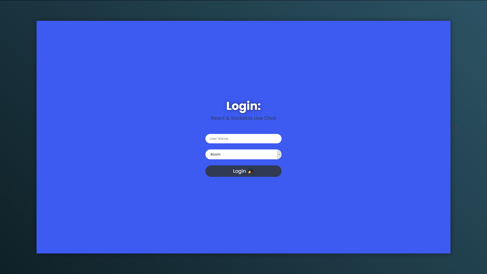
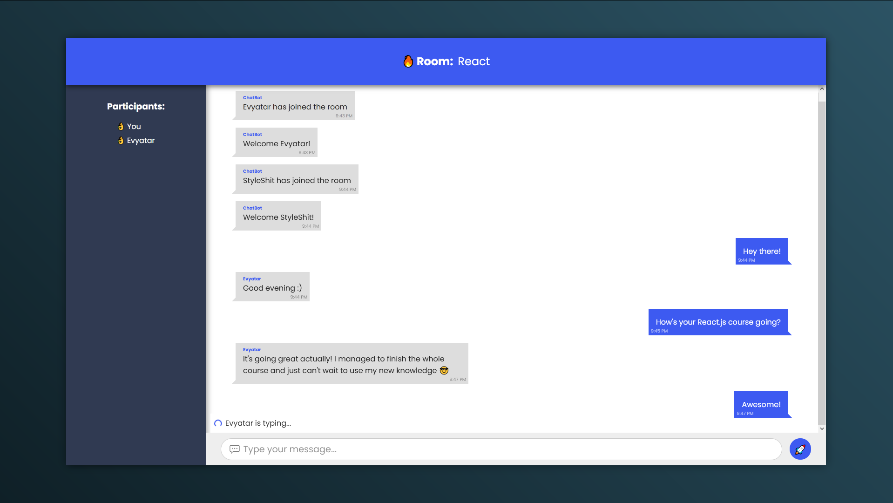

# Live Chat

A simple live chat using React / Socket.io for client, and Node.js / Express / Socket.io for server.

## Installation:

Clone this git, then `npm run install:all && npm run dev`

## Available commands:

You can use the following commands after cloning this git:

### `npm run install:all`

Installl all project dependencies.

### `npm run dev`

Start the app in development mode. 
Open [http://localhost:3000](http://localhost:3000) to view in the browser.

### `npm run server`

Starts only the chat server in development mode.

### `npm run client`

Starts only the chat client in development mode.

### `npm start`

Runs the chat in production mode. 
Use it after you run `npm run build` which builds the client and serves it from the `/public` directory on the server.

### `npm run build`

Build project for production. 
Copy the contents of `/server` to your server and `npm start` from there.